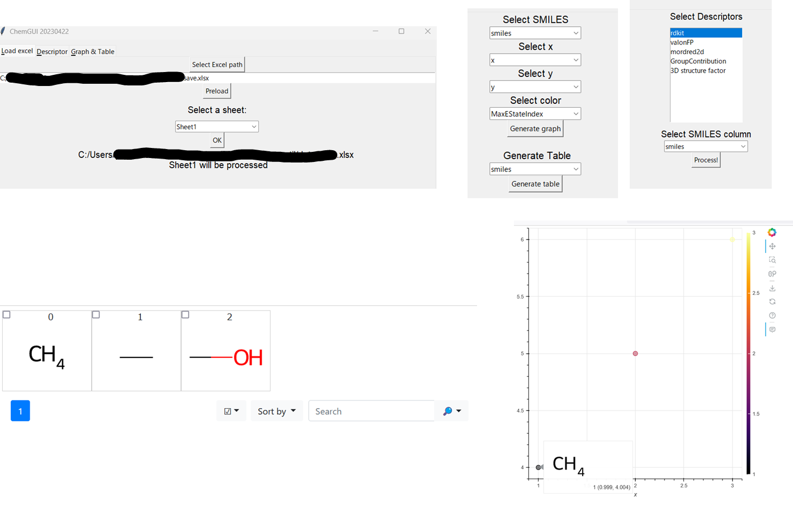

# Simple GUI tools for ChemInformatics

# What can be done?
- Calcualte basic descriptors
- Export Graphs with molecular structures
- Export Tables with molecular structures
## For Python users
- python main.py
## For Windows users
- Download the executable program [Here](https://drive.google.com/file/d/1xPddSJhPOul1K-u3ZmkMvNenHT7BHTdJ/view?usp=sharing) and Run main.exe
## For Mac users
- Ask someone to make the executable program
    e.g.,
    pyinstaller main.py --noconsole --copy-metadata bokeh

## Issues
- Table data generation by [Mol2Grid](https://mols2grid.readthedocs.io/en/latest/contents.html#usage) would fail. You can instead access function via e.g, [KNIME](https://www.knime.com/) (`Interactive Grid of Molecules`).